# System Architecture: claude-memory

## Overview

claude-memory is a hybrid Claude Code plugin that combines three extension mechanisms to achieve 75% lower token overhead than pure MCP solutions:

1. **Skill Layer**: Teaches Claude memory patterns (~2000 tokens when active)
2. **MCP Server**: Handles computation-heavy operations (embeddings, search, storage)
3. **Hooks Layer**: Provides deterministic automation (session management, error capture)

This architecture separates concerns optimally: Skills teach behavior, MCP computes, Hooks automate.

## System Context Diagram

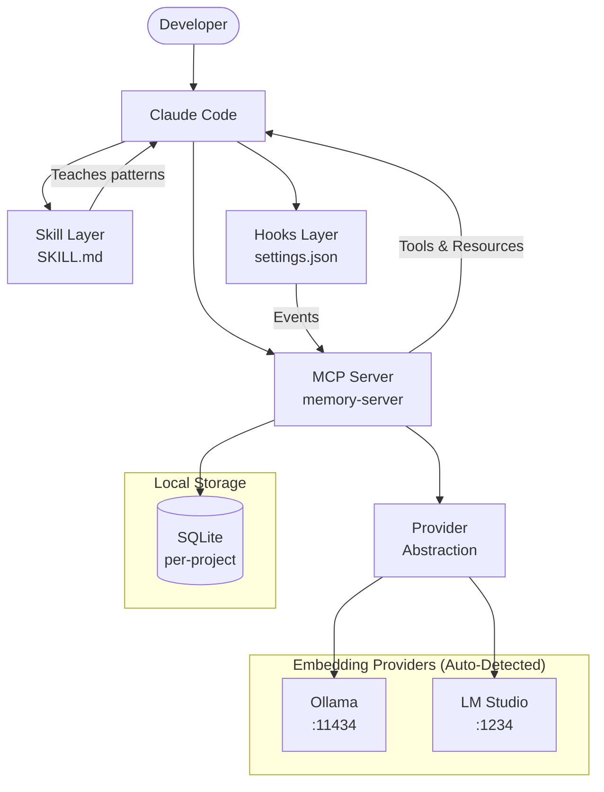

## Component Architecture

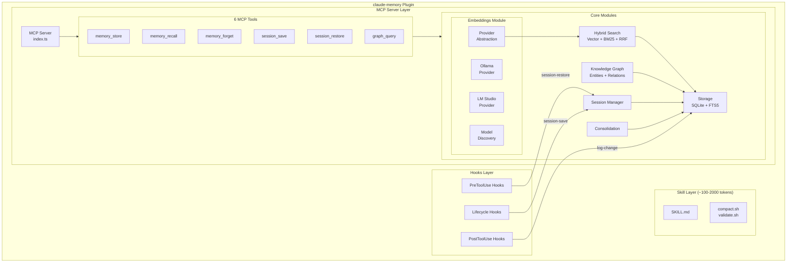

## Layer Descriptions

### Skill Layer (Teaching)

**Responsibility**: Teach Claude when and how to use memory effectively

**Components:**
| Component | File | Purpose |
|-----------|------|---------|
| Memory Skill | `skills/memory/SKILL.md` | Pattern recognition for memory operations |
| Compact Script | `skills/memory/scripts/compact.sh` | Context summarization helper |
| Validate Script | `skills/memory/scripts/validate.sh` | Memory consistency checker |

**Token Efficiency:**
- Metadata: ~100 tokens (always loaded with skill directory)
- Full skill: ~2000 tokens (loaded when memory task detected)
- Progressive disclosure minimizes overhead

**Traces To:** SK-001, SK-002, SK-003

### MCP Server Layer (Computation)

**Responsibility**: Handle computation-heavy operations that cannot be done in Skills

**Components:**
| Component | Directory | Purpose |
|-----------|-----------|---------|
| Server Core | `mcp/memory-server/src/index.ts` | MCP protocol handling |
| Embeddings | `mcp/memory-server/src/embeddings/` | Multi-provider abstraction (Ollama, LM Studio) |
| Search | `mcp/memory-server/src/search/` | Hybrid Vector+BM25+RRF |
| Storage | `mcp/memory-server/src/storage/` | SQLite + FTS5 |
| Graph | `mcp/memory-server/src/graph/` | Entity/relation management |
| Session | `mcp/memory-server/src/session/` | Session state persistence |
| Consolidation | `mcp/memory-server/src/consolidation/` | Memory cleanup |

**Embeddings Module Detail:**
| File | Purpose | FR |
|------|---------|-----|
| `index.ts` | Provider abstraction & auto-detection | FR-040, FR-044 |
| `ollama.ts` | Ollama API client (native format) | FR-041 |
| `lmstudio.ts` | LM Studio client (OpenAI-compatible) | FR-041 |
| `discovery.ts` | Model discovery & filtering | FR-045 |
| `validation.ts` | Model validation on selection | FR-047 |
| `cache.ts` | Embedding cache by content hash | FR-042 |

**Tools (6 focused tools):**
| Tool | Purpose | FR |
|------|---------|-----|
| memory_store | Store with embedding + entity extraction | FR-010 |
| memory_recall | Hybrid search with citations | FR-011 |
| memory_forget | Soft-delete with provenance | FR-012 |
| session_save | Persist session state | FR-070 |
| session_restore | Load previous session | FR-071 |
| graph_query | Query entity relationships | FR-053 |

**Traces To:** MCP-001, MCP-002, MCP-003

### Hooks Layer (Automation)

**Responsibility**: Deterministic automation for critical operations

**Components:**
| Hook Type | Matcher | Action | HK |
|-----------|---------|--------|-----|
| PreToolUse | SessionStart | Auto-restore session | HK-001 |
| PreToolUse | Read(CLAUDE.md) | Sync to core memory | HK-002 |
| PreToolUse | DirectoryChange | Project switch | HK-006 |
| PostToolUse | Edit\|Write | Log file changes | HK-003 |
| PostToolUse | Bash(error) | Capture errors | HK-004 |
| SessionEnd | - | Auto-save session | HK-005 |

**Traces To:** HK-001 through HK-006

### Data Layer (Storage)

**Responsibility**: Persistent storage with project isolation

**Location:** `~/.claude-memory/<project-hash>/memory.db`

**Components:**
- SQLite database with WAL mode
- FTS5 virtual table for BM25 search
- BLOB columns for embedding vectors
- Separate database per project (FR-081)

**Traces To:** FR-090, FR-091, FR-080

## Key Workflows

### Workflow 1: Memory Store

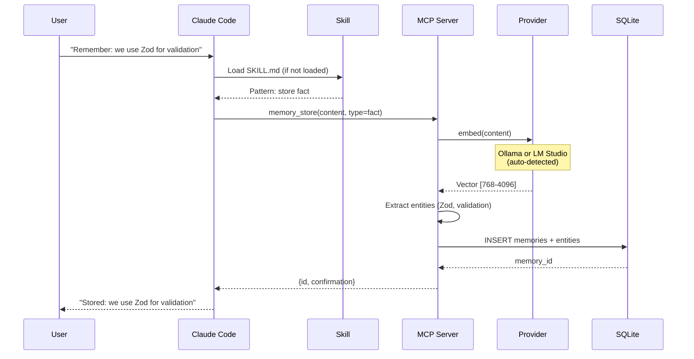

### Workflow 2: Memory Recall (Hybrid Search)

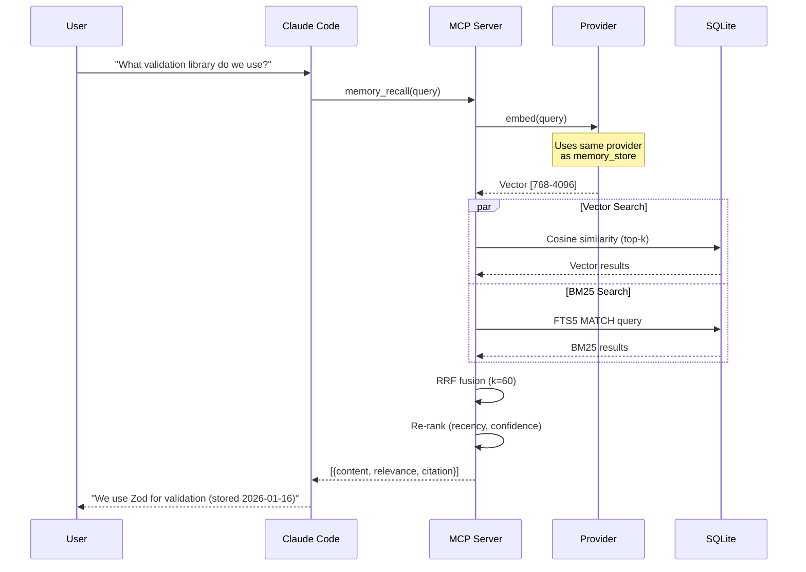

### Workflow 3: Session Restore (Hook-Driven)

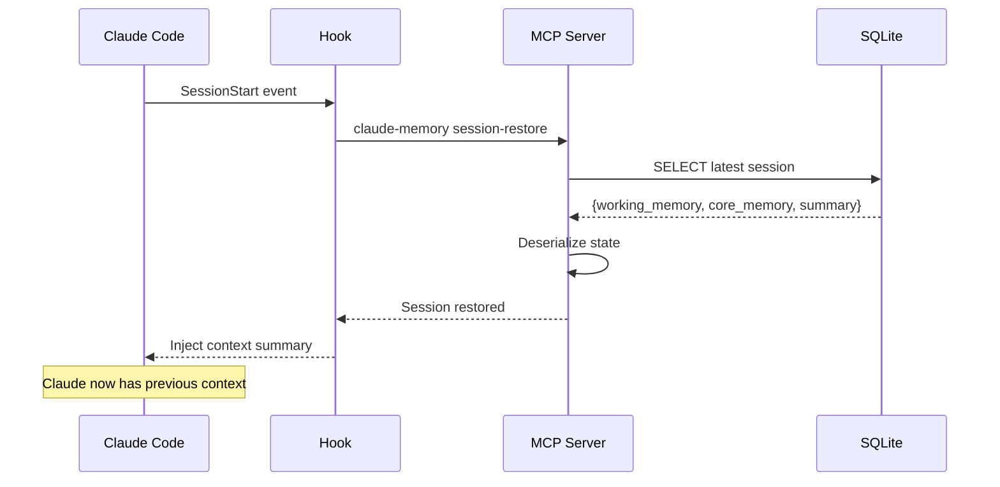

### Workflow 4: Project Switch (Hook-Driven)

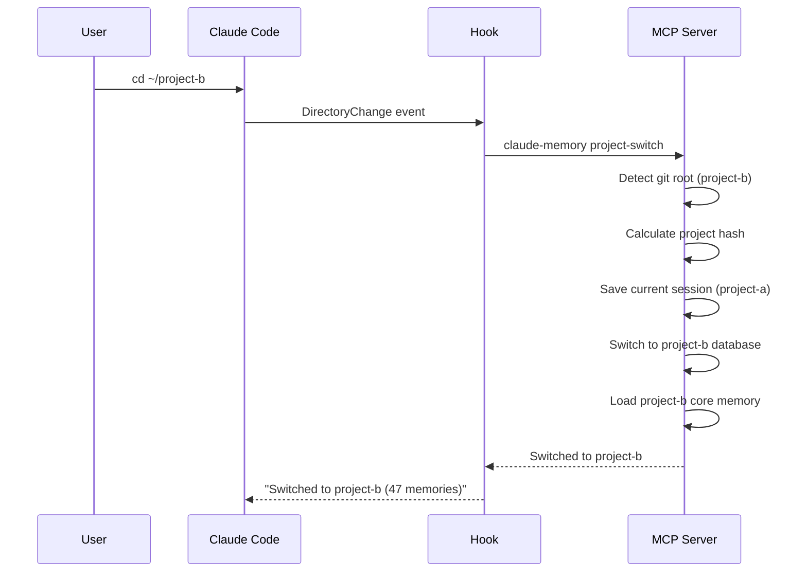

### Workflow 5: Auto-Compact (Skill + Script)

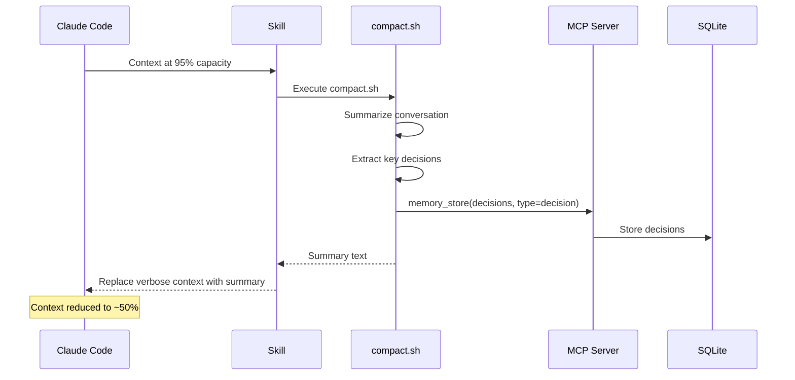

### Workflow 6: Provider Auto-Detection (Startup)

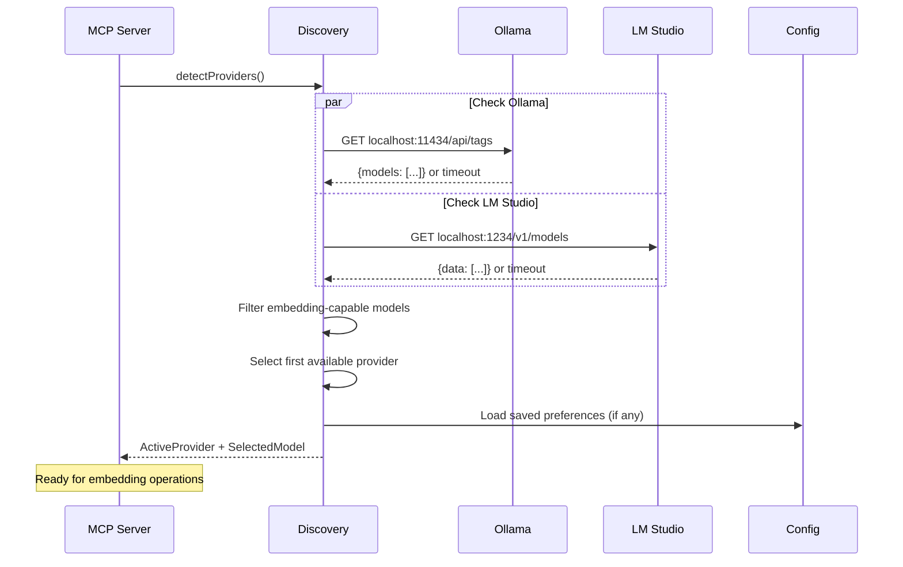

### Workflow 7: Model Configuration (/memory config)

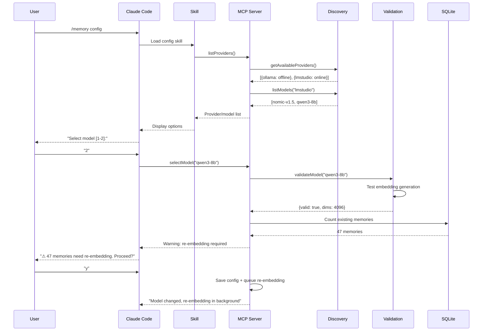

## Module Structure

```
claude-memory/
├── .claude-plugin/
│   ├── manifest.json           # Plugin metadata (PL-001)
│   └── marketplace.json        # Distribution info (PL-003)
│
├── skills/
│   └── memory/
│       ├── SKILL.md            # Memory patterns (~2000 tokens)
│       └── scripts/
│           ├── compact.sh      # Context compaction
│           └── validate.sh     # Memory validation
│
├── mcp/
│   └── memory-server/
│       ├── package.json
│       ├── tsconfig.json
│       └── src/
│           ├── index.ts            # MCP server entry
│           ├── types.ts            # Shared types
│           ├── config.ts           # Configuration loading
│           │
│           ├── embeddings/
│           │   ├── index.ts        # Provider abstraction & auto-detection
│           │   ├── types.ts        # EmbeddingProvider interface
│           │   ├── ollama.ts       # Ollama client (native API)
│           │   ├── lmstudio.ts     # LM Studio client (OpenAI-compatible)
│           │   ├── discovery.ts    # Model discovery & filtering
│           │   ├── validation.ts   # Model validation on selection
│           │   └── cache.ts        # Embedding cache by content hash
│           │
│           ├── search/
│           │   ├── index.ts        # Search orchestration
│           │   ├── vector.ts       # Cosine similarity
│           │   ├── bm25.ts         # BM25 via FTS5
│           │   └── rrf.ts          # Reciprocal Rank Fusion
│           │
│           ├── storage/
│           │   ├── index.ts        # Storage abstraction
│           │   ├── database.ts     # SQLite connection
│           │   ├── schema.ts       # Table definitions
│           │   ├── migrations.ts   # Schema migrations
│           │   └── repository.ts   # CRUD operations
│           │
│           ├── graph/
│           │   ├── index.ts        # Graph operations
│           │   ├── entities.ts     # Entity management
│           │   ├── relations.ts    # Relationship management
│           │   └── temporal.ts     # Bi-temporal queries
│           │
│           ├── session/
│           │   ├── index.ts        # Session management
│           │   ├── state.ts        # State serialization
│           │   └── restore.ts      # Session restoration
│           │
│           ├── consolidation/
│           │   ├── index.ts        # Consolidation orchestration
│           │   ├── decay.ts        # Confidence decay
│           │   └── cleanup.ts      # Duplicate/stale removal
│           │
│           └── tools/
│               ├── memory_store.ts
│               ├── memory_recall.ts
│               ├── memory_forget.ts
│               ├── session_save.ts
│               ├── session_restore.ts
│               └── graph_query.ts
│
├── hooks/
│   └── settings.json           # Hook configurations
│
├── tests/
│   ├── unit/
│   ├── integration/
│   └── benchmark/
│
└── docs/
    └── 3-design/               # This document
```

## Design Patterns

| Pattern | Usage | Rationale |
|---------|-------|-----------|
| Repository | `storage/repository.ts` | Abstracts data access; testability |
| Strategy | `embeddings/index.ts` | Swappable embedding providers |
| Facade | `search/index.ts` | Unified search interface over vector + BM25 |
| Observer | Hooks layer | Decouple events from handlers |
| Factory | Tool handlers | Consistent tool response creation |

## Error Handling Strategy

### Layer-Specific Handling

| Layer | Error Type | Handling |
|-------|------------|----------|
| Skill | Bash errors | Scripts return exit codes; skill interprets |
| MCP | Tool errors | JSON-RPC error response with code/message |
| Hooks | Command failures | Log and continue; don't block Claude |
| Storage | SQLite errors | Transaction rollback; clear error message |
| Embeddings | Server unavailable | Graceful degradation to BM25-only |

### Error Flow

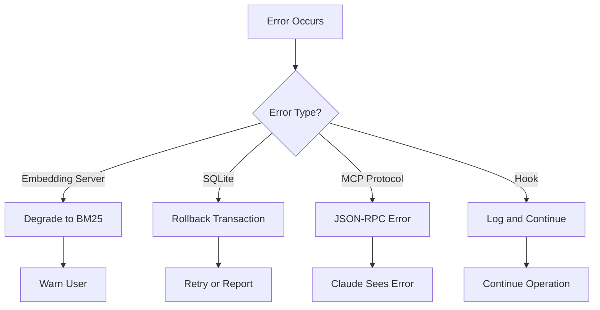

**Traces To:** NFR-011, NFR-012, NFR-021

## Configuration Management

### Configuration Hierarchy

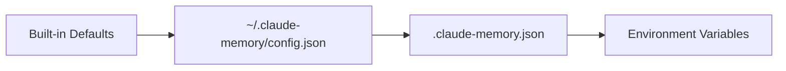

### Configuration Sources

| Source | Location | Priority |
|--------|----------|----------|
| Defaults | Compiled into code | Lowest |
| Global | `~/.claude-memory/config.json` | Low |
| Project | `.claude-memory.json` | Medium |
| Environment | `CLAUDE_MEMORY_*` | Highest |

**Traces To:** FR-100, FR-101, FR-102, DC-002

## Resource Boundaries

### Memory Allocation

| Component | Budget | Notes |
|-----------|--------|-------|
| Core Memory | 15% | MemGPT-style blocks |
| Working Memory | 20% | Session-scoped volatile |
| Archival Retrieval | 25% | From SQLite on query |
| Current Task | 40% | User's active work |

**Traces To:** FR-061

### Storage Boundaries

| Resource | Limit | Rationale |
|----------|-------|-----------|
| Database per project | 100MB target | NFR-005 |
| Embedding cache | By content hash | Avoid recomputation |
| Session history | Last 10 | Reasonable recovery |

## Cross-Cutting Concerns

### Logging

- Structured JSON logs for debugging
- Configurable verbosity levels
- No sensitive data in logs (SC-001)

### Observability

- Token usage tracking per operation
- Search latency metrics
- Memory statistics (count, size, types)

**Traces To:** DC-003

### Project Isolation

- SHA256 hash of git root for project ID
- Separate SQLite database per project
- Validation at every storage operation

**Traces To:** FR-080, FR-081, FR-083

## Deployment Model

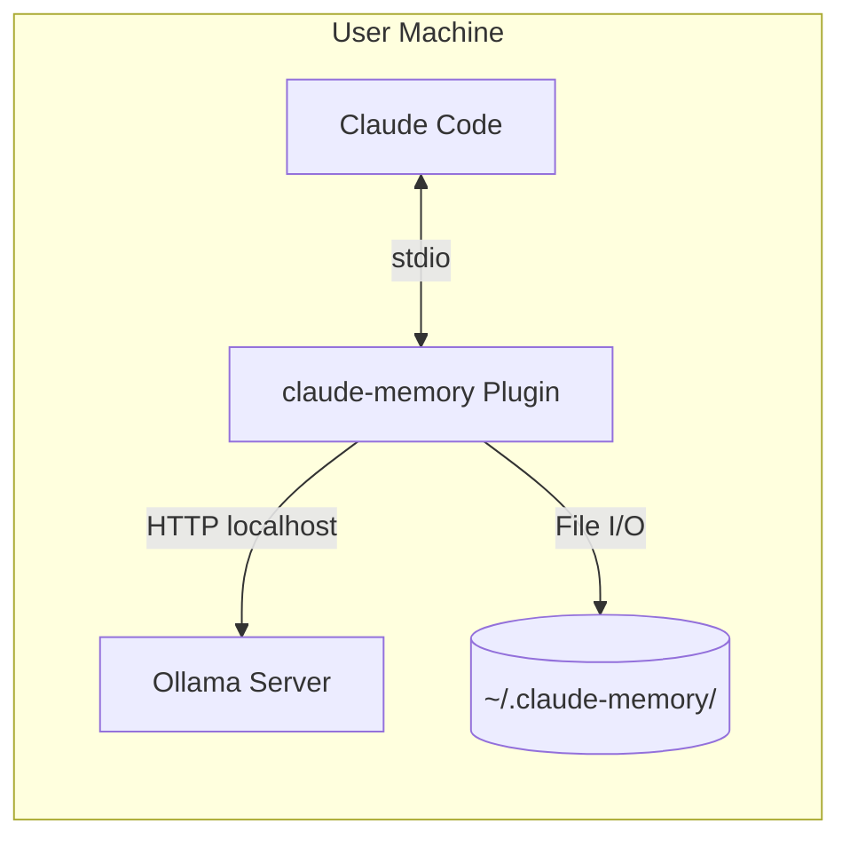

- Single-machine deployment
- No cloud dependencies
- Ollama runs as separate process (user-managed)
- All data stored locally

**Traces To:** TC-002, OC-001, SC-002
