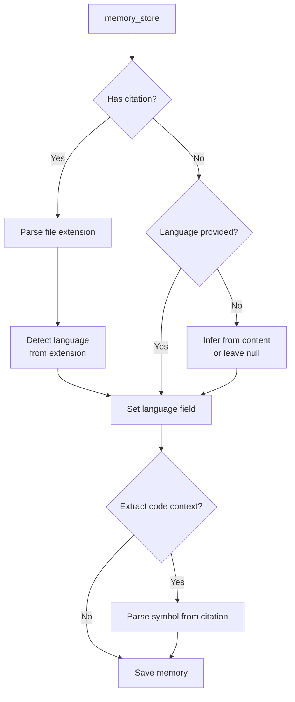
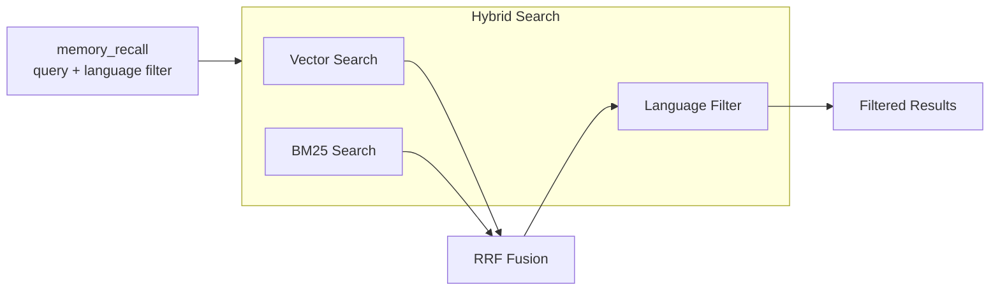
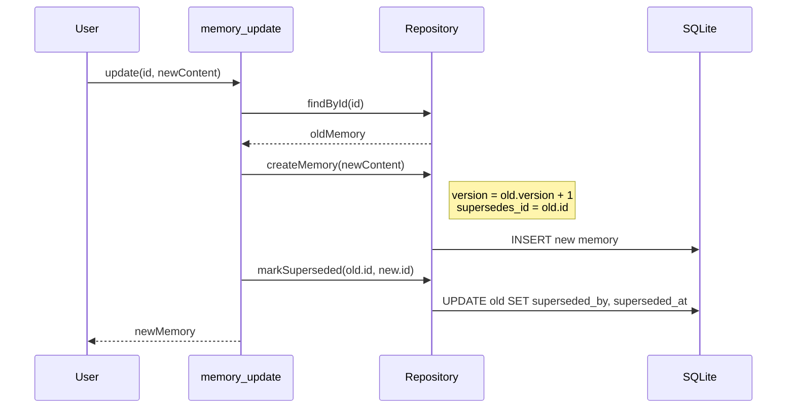
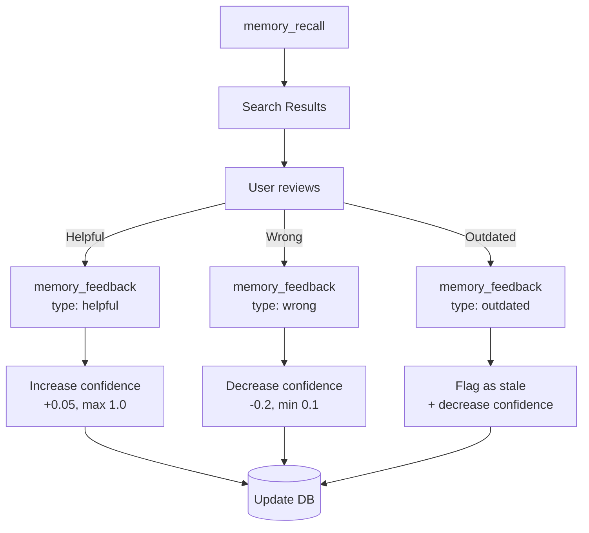
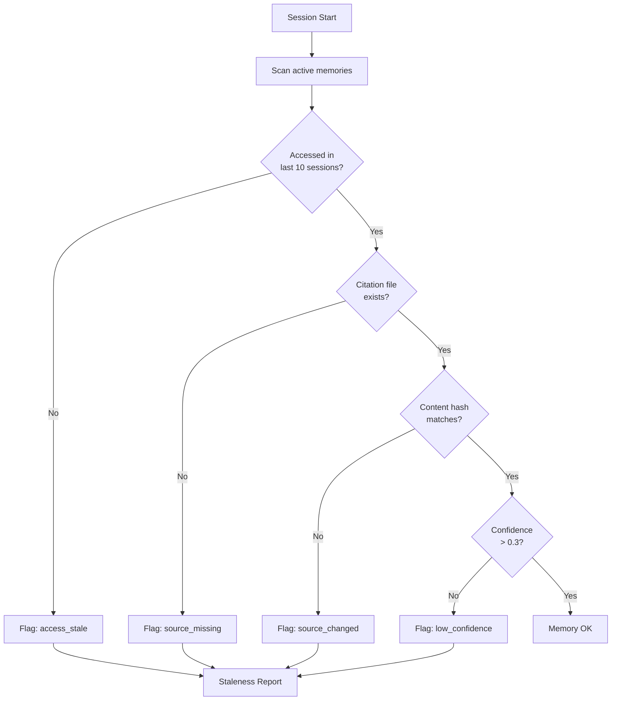
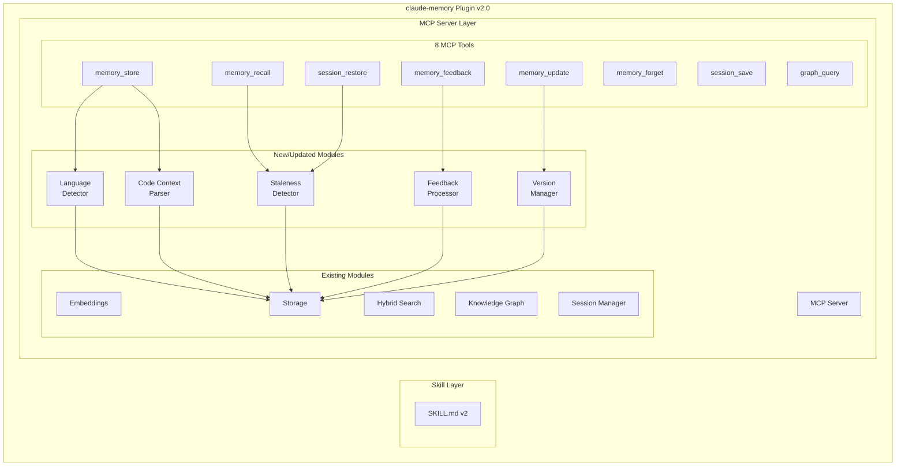

# Architecture Extension: claude-memory v2.0

## Document Information

| Field | Value |
|-------|-------|
| Version | 2.0 |
| Date | 2026-01-18 |
| Status | Draft |
| Extends | ARCHITECTURE.md v1.0 |
| Purpose | Address gaps identified in GAPS.md |

## Overview

This document describes architectural changes to claude-memory to address:
1. **Source Code Knowledge** - Language-aware memory storage
2. **Memory Relationships** - Versioning and supersession
3. **Feedback Loop** - Learning from wrong recalls
4. **Staleness Detection** - Automatic flagging of outdated memories

These changes are **additive** - they extend the existing architecture without breaking backward compatibility.

---

## 1. Source Code Knowledge Architecture

### 1.1 Current vs Proposed

```
CURRENT:
┌─────────────────────────────────────────┐
│ Memory                                  │
│ ├── content: "UserService handles auth" │
│ ├── type: fact                          │
│ └── citation: "src/UserService.ts:45"   │ ← Just a string
└─────────────────────────────────────────┘

PROPOSED (V2):
┌─────────────────────────────────────────┐
│ Memory                                  │
│ ├── content: "UserService handles auth" │
│ ├── type: fact                          │
│ ├── language: typescript                │ ← NEW
│ └── codeContext: {                      │ ← NEW (structured)
│       filePath: "src/UserService.ts",   │
│       startLine: 45,                    │
│       endLine: 120,                     │
│       symbolName: "UserService",        │
│       symbolType: "class"               │
│     }                                   │
└─────────────────────────────────────────┘
```

### 1.2 Language Detection Flow



### 1.3 Language-Aware Search



### 1.4 Supported Languages

| Language | Extensions | Detection |
|----------|------------|-----------|
| TypeScript | .ts, .tsx | ✓ Auto |
| JavaScript | .js, .jsx, .mjs | ✓ Auto |
| Python | .py | ✓ Auto |
| Rust | .rs | ✓ Auto |
| Go | .go | ✓ Auto |
| Java | .java | ✓ Auto |
| C/C++ | .c, .cpp, .h, .hpp | ✓ Auto |
| Ruby | .rb | ✓ Auto |
| PHP | .php | ✓ Auto |
| Shell | .sh, .bash | ✓ Auto |
| SQL | .sql | ✓ Auto |
| Markdown | .md | ✓ Auto |
| JSON | .json | ✓ Auto |
| YAML | .yaml, .yml | ✓ Auto |
| Other | * | Manual |

---

## 2. Memory Relationships Architecture

### 2.1 Supersession Model

```mermaid
flowchart TD
    subgraph Timeline
        M1[Memory v1<br/>"Uses Express"]
        M2[Memory v2<br/>"Uses Fastify"<br/>supersedes: M1]
        M3[Memory v3<br/>"Uses Hono"<br/>supersedes: M2]
    end

    M1 -->|superseded by| M2
    M2 -->|superseded by| M3

    Query[memory_recall] --> M3
    M3 -.->|history available| M2
    M2 -.->|history available| M1
```

### 2.2 Version Chain

```typescript
interface Memory {
  // ... existing fields

  // NEW: Version tracking
  version: number;              // Auto-incremented
  supersedes_id: string | null; // Previous version
  superseded_by: string | null; // Next version (set when superseded)
  superseded_at: Date | null;   // When this was superseded
}
```

### 2.3 Update Flow with Versioning



---

## 3. Feedback Loop Architecture

### 3.1 Feedback Flow



### 3.2 New MCP Tool: memory_feedback

```typescript
{
  name: 'memory_feedback',
  description: 'Provide feedback on a recalled memory',
  inputSchema: {
    type: 'object',
    properties: {
      id: { type: 'string', format: 'uuid' },
      feedback: {
        type: 'string',
        enum: ['helpful', 'wrong', 'outdated', 'duplicate']
      },
      correction: {
        type: 'string',
        description: 'Corrected information (for wrong/outdated)'
      }
    },
    required: ['id', 'feedback']
  }
}
```

### 3.3 Confidence Adjustment Rules

| Feedback | Confidence Change | Additional Action |
|----------|-------------------|-------------------|
| `helpful` | +0.05 (max 1.0) | Increment access_count |
| `wrong` | -0.20 (min 0.1) | Flag for review |
| `outdated` | -0.30 (min 0.1) | Set flagged_at, suggest update |
| `duplicate` | No change | Link to canonical memory |

---

## 4. Staleness Detection Architecture

### 4.1 Staleness Criteria

A memory is flagged as potentially stale when ANY of:
1. **Access staleness**: Not accessed in last N sessions (default: 10)
2. **Source staleness**: Citation file no longer exists
3. **Content staleness**: Citation file content hash changed significantly
4. **Confidence decay**: Confidence dropped below 0.3 via feedback
5. **Age staleness**: Created > 90 days ago AND never accessed

### 4.2 Detection Flow



### 4.3 Staleness Report (Session Start)

```
╔════════════════════════════════════════════════════════════╗
║ Memory Staleness Report                                    ║
╠════════════════════════════════════════════════════════════╣
║ 5 memories may need review:                                ║
║                                                            ║
║ 🔴 Source Missing (2):                                     ║
║    • "Auth config in src/old/auth.ts" - file deleted       ║
║    • "API routes in routes.js" - file deleted              ║
║                                                            ║
║ 🟡 Source Changed (1):                                     ║
║    • "Database uses PostgreSQL" - db.ts modified           ║
║                                                            ║
║ 🟠 Not Accessed (2):                                       ║
║    • "Legacy API format" - 15 sessions ago                 ║
║    • "Old error workaround" - 12 sessions ago              ║
║                                                            ║
║ Run: memory_recall({ query: "stale:true" }) to review      ║
╚════════════════════════════════════════════════════════════╝
```

---

## 5. Updated Component Diagram



---

## 6. Migration Strategy

### 6.1 Phases

| Phase | Changes | Backward Compatible |
|-------|---------|---------------------|
| 1 | Add new columns with defaults | ✓ Yes |
| 2 | Deploy new tools | ✓ Yes |
| 3 | Enable staleness detection | ✓ Yes |
| 4 | Backfill language from citations | ✓ Yes |

### 6.2 Schema Migration

```sql
-- Phase 1: Add columns (backward compatible)
ALTER TABLE memories ADD COLUMN language TEXT;
ALTER TABLE memories ADD COLUMN code_context TEXT;  -- JSON
ALTER TABLE memories ADD COLUMN version INTEGER DEFAULT 1;
ALTER TABLE memories ADD COLUMN supersedes_id TEXT REFERENCES memories(id);
ALTER TABLE memories ADD COLUMN superseded_by TEXT;
ALTER TABLE memories ADD COLUMN superseded_at INTEGER;
ALTER TABLE memories ADD COLUMN flagged_at INTEGER;
ALTER TABLE memories ADD COLUMN flagged_reason TEXT;

-- Phase 4: Backfill language from existing citations
UPDATE memories
SET language = CASE
    WHEN citation LIKE '%.ts:%' OR citation LIKE '%.tsx:%' THEN 'typescript'
    WHEN citation LIKE '%.js:%' OR citation LIKE '%.jsx:%' THEN 'javascript'
    WHEN citation LIKE '%.py:%' THEN 'python'
    WHEN citation LIKE '%.rs:%' THEN 'rust'
    WHEN citation LIKE '%.go:%' THEN 'go'
    ELSE NULL
END
WHERE citation IS NOT NULL AND language IS NULL;
```

---

## 7. API Changes Summary

### 7.1 memory_store (Updated)

```typescript
// New optional fields
{
  content: string,
  type?: MemoryType,
  confidence?: number,
  citation?: string,
  // NEW
  language?: Language,
  codeContext?: {
    filePath: string,
    startLine: number,
    endLine?: number,
    symbolName?: string,
    symbolType?: 'function' | 'class' | 'variable' | 'type' | 'module'
  }
}
```

### 7.2 memory_recall (Updated)

```typescript
// New optional filter
{
  query: string,
  type?: MemoryType,
  limit?: number,
  minConfidence?: number,
  // NEW
  language?: Language,
  includeStale?: boolean,  // Default: false
  includeSuperseded?: boolean  // Default: false
}
```

### 7.3 memory_feedback (New)

```typescript
{
  id: string,
  feedback: 'helpful' | 'wrong' | 'outdated' | 'duplicate',
  correction?: string,
  duplicateOf?: string  // For duplicate feedback
}
```

### 7.4 memory_update (Updated)

```typescript
// Now creates new version instead of in-place update
{
  id: string,
  content: string,
  // Optional: update metadata too
  language?: Language,
  codeContext?: CodeContext
}
// Returns: new memory with version = old.version + 1
```

---

## 8. Traceability

| Change | Traces To | Gap |
|--------|-----------|-----|
| Language field | US-NEW-001 | Source Code Knowledge 1.1 |
| Code context | US-NEW-002 | Source Code Knowledge 1.2 |
| Memory versioning | US-011, US-NEW-003 | Architectural 3.1 |
| memory_feedback | US-048, US-NEW-004 | Integration 4.2 |
| Staleness detection | US-046, US-017 | User Story 2.1 |
| Language-aware search | US-NEW-005 | Source Code Knowledge 1.3 |

---

## 9. Acceptance Criteria

### 9.1 Source Code Knowledge
- [ ] Language auto-detected from citation file extension
- [ ] Language can be manually specified
- [ ] Code context parsed from citations
- [ ] Search filterable by language
- [ ] Existing memories backfilled

### 9.2 Memory Relationships
- [ ] memory_update creates new version
- [ ] Old version marked as superseded
- [ ] Version history queryable
- [ ] Superseded memories excluded from default search

### 9.3 Feedback Loop
- [ ] memory_feedback tool registered
- [ ] Confidence adjusted per feedback
- [ ] Wrong/outdated memories flagged
- [ ] Correction creates new superseding memory

### 9.4 Staleness Detection
- [ ] Staleness check runs on session_restore
- [ ] Report generated for stale memories
- [ ] Stale memories excluded from default search
- [ ] Manual review workflow documented
