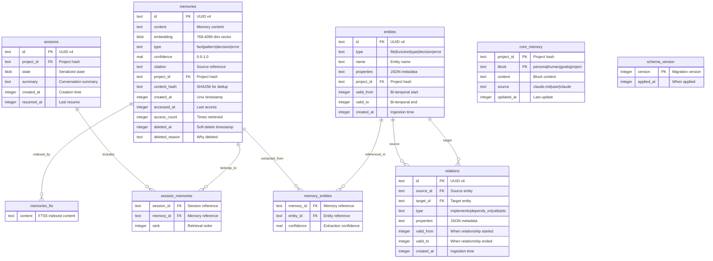
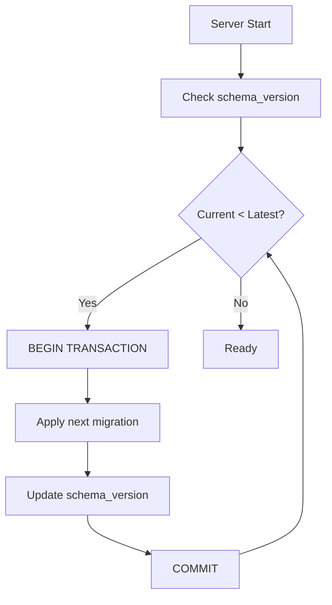

# Database Design: claude-memory

## Overview

claude-memory uses SQLite as its sole persistence mechanism, leveraging:
- **WAL mode** for crash-safe concurrent access
- **FTS5** for BM25 full-text search
- **BLOB columns** for embedding vector storage
- **Separate databases** per project for isolation

This approach satisfies constraints TC-003 (SQLite-Only) and OC-001 (No External Services).

## Entity-Relationship Diagram



## Schema Definition

### Table: memories

Primary storage for all memory entries.

| Column | Type | Constraints | Description |
|--------|------|-------------|-------------|
| id | TEXT | PK | UUID v4 identifier |
| content | TEXT | NOT NULL | Memory content (searchable) |
| embedding | BLOB | NULL | Variable-dim float32 vector (768-4096 dims based on model) |
| type | TEXT | NOT NULL | Enum: fact, pattern, decision, error, preference |
| confidence | REAL | DEFAULT 1.0 | Confidence score 0.0-1.0 |
| citation | TEXT | NULL | Source file:line reference |
| project_id | TEXT | NOT NULL, FK | Project hash for isolation |
| content_hash | TEXT | NOT NULL | SHA256 for deduplication |
| created_at | INTEGER | NOT NULL | Unix timestamp (seconds) |
| accessed_at | INTEGER | NOT NULL | Last access timestamp |
| access_count | INTEGER | DEFAULT 0 | Retrieval count for ranking |
| deleted_at | INTEGER | NULL | Soft delete timestamp |
| deleted_reason | TEXT | NULL | Reason for deletion |

**Indexes:**
- `idx_memories_project` on `(project_id)` - Project isolation queries
- `idx_memories_type` on `(project_id, type)` - Type filtering
- `idx_memories_hash` on `(content_hash)` - Deduplication check
- `idx_memories_accessed` on `(project_id, accessed_at DESC)` - Recency ranking
- `idx_memories_active` on `(project_id, deleted_at)` - Active memories filter

**SQL:**
```sql
CREATE TABLE memories (
    id TEXT PRIMARY KEY,
    content TEXT NOT NULL,
    embedding BLOB,
    type TEXT NOT NULL CHECK (type IN ('fact', 'pattern', 'decision', 'error', 'preference')),
    confidence REAL NOT NULL DEFAULT 1.0 CHECK (confidence >= 0.0 AND confidence <= 1.0),
    citation TEXT,
    project_id TEXT NOT NULL,
    content_hash TEXT NOT NULL,
    created_at INTEGER NOT NULL,
    accessed_at INTEGER NOT NULL,
    access_count INTEGER NOT NULL DEFAULT 0,
    deleted_at INTEGER,
    deleted_reason TEXT
);

CREATE INDEX idx_memories_project ON memories(project_id);
CREATE INDEX idx_memories_type ON memories(project_id, type);
CREATE INDEX idx_memories_hash ON memories(content_hash);
CREATE INDEX idx_memories_accessed ON memories(project_id, accessed_at DESC);
CREATE INDEX idx_memories_active ON memories(project_id, deleted_at);
```

**Traces To:** FR-010, FR-011, FR-012

---

### Table: core_memory

MemGPT-style self-editable memory blocks.

| Column | Type | Constraints | Description |
|--------|------|-------------|-------------|
| project_id | TEXT | PK | Project hash |
| block | TEXT | PK | Block type: persona, human, goals, project |
| content | TEXT | NOT NULL | Block content |
| source | TEXT | NOT NULL | Origin: claude.md, user, claude |
| updated_at | INTEGER | NOT NULL | Last update timestamp |

**SQL:**
```sql
CREATE TABLE core_memory (
    project_id TEXT NOT NULL,
    block TEXT NOT NULL CHECK (block IN ('persona', 'human', 'goals', 'project')),
    content TEXT NOT NULL,
    source TEXT NOT NULL CHECK (source IN ('claude.md', 'user', 'claude')),
    updated_at INTEGER NOT NULL,
    PRIMARY KEY (project_id, block)
);
```

**Traces To:** FR-021

---

### Table: sessions

Persisted session states for continuity.

| Column | Type | Constraints | Description |
|--------|------|-------------|-------------|
| id | TEXT | PK | UUID v4 identifier |
| project_id | TEXT | NOT NULL, FK | Project hash |
| state | BLOB | NOT NULL | Serialized working memory + core memory |
| summary | TEXT | NULL | Human-readable conversation summary |
| created_at | INTEGER | NOT NULL | Creation timestamp |
| resumed_at | INTEGER | NULL | Last resume timestamp |

**Indexes:**
- `idx_sessions_project` on `(project_id, created_at DESC)` - Latest session lookup

**SQL:**
```sql
CREATE TABLE sessions (
    id TEXT PRIMARY KEY,
    project_id TEXT NOT NULL,
    state BLOB NOT NULL,
    summary TEXT,
    created_at INTEGER NOT NULL,
    resumed_at INTEGER
);

CREATE INDEX idx_sessions_project ON sessions(project_id, created_at DESC);
```

**Traces To:** FR-070, FR-071, FR-072

---

### Table: entities

Knowledge graph nodes.

| Column | Type | Constraints | Description |
|--------|------|-------------|-------------|
| id | TEXT | PK | UUID v4 identifier |
| type | TEXT | NOT NULL | Entity type |
| name | TEXT | NOT NULL | Entity name |
| properties | TEXT | NULL | JSON metadata |
| project_id | TEXT | NOT NULL | Project hash |
| valid_from | INTEGER | NOT NULL | When entity became valid |
| valid_to | INTEGER | NULL | When entity became invalid |
| created_at | INTEGER | NOT NULL | Ingestion timestamp |

**Indexes:**
- `idx_entities_project_type` on `(project_id, type)` - Type queries
- `idx_entities_project_name` on `(project_id, name)` - Name lookup
- `idx_entities_temporal` on `(project_id, valid_from, valid_to)` - Bi-temporal queries

**SQL:**
```sql
CREATE TABLE entities (
    id TEXT PRIMARY KEY,
    type TEXT NOT NULL CHECK (type IN ('file', 'function', 'type', 'decision', 'error')),
    name TEXT NOT NULL,
    properties TEXT,
    project_id TEXT NOT NULL,
    valid_from INTEGER NOT NULL,
    valid_to INTEGER,
    created_at INTEGER NOT NULL
);

CREATE INDEX idx_entities_project_type ON entities(project_id, type);
CREATE INDEX idx_entities_project_name ON entities(project_id, name);
CREATE INDEX idx_entities_temporal ON entities(project_id, valid_from, valid_to);
```

**Traces To:** FR-050

---

### Table: relations

Knowledge graph edges.

| Column | Type | Constraints | Description |
|--------|------|-------------|-------------|
| id | TEXT | PK | UUID v4 identifier |
| source_id | TEXT | NOT NULL, FK | Source entity ID |
| target_id | TEXT | NOT NULL, FK | Target entity ID |
| type | TEXT | NOT NULL | Relationship type |
| properties | TEXT | NULL | JSON metadata |
| valid_from | INTEGER | NOT NULL | When relationship started |
| valid_to | INTEGER | NULL | When relationship ended |
| created_at | INTEGER | NOT NULL | Ingestion timestamp |

**Indexes:**
- `idx_relations_source` on `(source_id)` - Outgoing edges
- `idx_relations_target` on `(target_id)` - Incoming edges
- `idx_relations_type` on `(type)` - Type filtering

**SQL:**
```sql
CREATE TABLE relations (
    id TEXT PRIMARY KEY,
    source_id TEXT NOT NULL REFERENCES entities(id),
    target_id TEXT NOT NULL REFERENCES entities(id),
    type TEXT NOT NULL CHECK (type IN ('implements', 'depends_on', 'satisfies', 'calls', 'contradicts', 'supersedes')),
    properties TEXT,
    valid_from INTEGER NOT NULL,
    valid_to INTEGER,
    created_at INTEGER NOT NULL
);

CREATE INDEX idx_relations_source ON relations(source_id);
CREATE INDEX idx_relations_target ON relations(target_id);
CREATE INDEX idx_relations_type ON relations(type);
```

**Traces To:** FR-051

---

### Table: memory_entities

Junction table linking memories to extracted entities.

| Column | Type | Constraints | Description |
|--------|------|-------------|-------------|
| memory_id | TEXT | PK, FK | Memory reference |
| entity_id | TEXT | PK, FK | Entity reference |
| confidence | REAL | NOT NULL | Extraction confidence |

**SQL:**
```sql
CREATE TABLE memory_entities (
    memory_id TEXT NOT NULL REFERENCES memories(id),
    entity_id TEXT NOT NULL REFERENCES entities(id),
    confidence REAL NOT NULL DEFAULT 1.0,
    PRIMARY KEY (memory_id, entity_id)
);
```

---

### Table: session_memories

Junction table linking sessions to working memory contents.

| Column | Type | Constraints | Description |
|--------|------|-------------|-------------|
| session_id | TEXT | PK, FK | Session reference |
| memory_id | TEXT | PK, FK | Memory reference |
| rank | INTEGER | NOT NULL | Retrieval order in session |

**SQL:**
```sql
CREATE TABLE session_memories (
    session_id TEXT NOT NULL REFERENCES sessions(id),
    memory_id TEXT NOT NULL REFERENCES memories(id),
    rank INTEGER NOT NULL,
    PRIMARY KEY (session_id, memory_id)
);
```

---

### Virtual Table: memories_fts

FTS5 virtual table for BM25 full-text search.

**SQL:**
```sql
CREATE VIRTUAL TABLE memories_fts USING fts5(
    content,
    content='memories',
    content_rowid='rowid'
);

-- Triggers to keep FTS in sync
CREATE TRIGGER memories_ai AFTER INSERT ON memories BEGIN
    INSERT INTO memories_fts(rowid, content) VALUES (NEW.rowid, NEW.content);
END;

CREATE TRIGGER memories_ad AFTER DELETE ON memories BEGIN
    INSERT INTO memories_fts(memories_fts, rowid, content) VALUES('delete', OLD.rowid, OLD.content);
END;

CREATE TRIGGER memories_au AFTER UPDATE ON memories BEGIN
    INSERT INTO memories_fts(memories_fts, rowid, content) VALUES('delete', OLD.rowid, OLD.content);
    INSERT INTO memories_fts(rowid, content) VALUES (NEW.rowid, NEW.content);
END;
```

**Traces To:** FR-031

---

### Table: schema_version

Migration tracking.

| Column | Type | Constraints | Description |
|--------|------|-------------|-------------|
| version | INTEGER | PK | Migration version number |
| applied_at | INTEGER | NOT NULL | When migration was applied |

**SQL:**
```sql
CREATE TABLE schema_version (
    version INTEGER PRIMARY KEY,
    applied_at INTEGER NOT NULL
);
```

**Traces To:** FR-091

---

## Queries

### Common Queries

#### Query: Store Memory
```sql
INSERT INTO memories (id, content, embedding, type, confidence, citation, project_id, content_hash, created_at, accessed_at)
VALUES (?, ?, ?, ?, ?, ?, ?, ?, ?, ?);
```
**Purpose**: Insert new memory entry with all metadata
**Performance**: O(1) with indexes; embedding BLOB write ~3ms

#### Query: Hybrid Search - Vector Component
```sql
SELECT id, content, embedding, type, confidence, citation, created_at, accessed_at, access_count
FROM memories
WHERE project_id = ?
  AND deleted_at IS NULL
  AND embedding IS NOT NULL;
```
**Purpose**: Retrieve all active memories with embeddings for cosine similarity
**Performance**: Table scan for vectors; computed in-memory. Target: <20ms for 1000 memories.

**Note**: Cosine similarity computed in TypeScript:
```typescript
function cosineSimilarity(a: Float32Array, b: Float32Array): number {
  let dot = 0, normA = 0, normB = 0;
  for (let i = 0; i < a.length; i++) {
    dot += a[i] * b[i];
    normA += a[i] * a[i];
    normB += b[i] * b[i];
  }
  return dot / (Math.sqrt(normA) * Math.sqrt(normB));
}
```

#### Query: Hybrid Search - BM25 Component
```sql
SELECT m.id, m.content, m.type, m.confidence, m.citation, m.created_at, m.accessed_at, m.access_count,
       bm25(memories_fts) as bm25_score
FROM memories m
JOIN memories_fts fts ON m.rowid = fts.rowid
WHERE memories_fts MATCH ?
  AND m.project_id = ?
  AND m.deleted_at IS NULL
ORDER BY bm25_score
LIMIT ?;
```
**Purpose**: BM25 keyword search via FTS5
**Performance**: O(log n) with FTS5 index; <10ms typical

#### Query: Get Latest Session
```sql
SELECT id, state, summary, created_at, resumed_at
FROM sessions
WHERE project_id = ?
ORDER BY created_at DESC
LIMIT 1;
```
**Purpose**: Retrieve most recent session for auto-restore
**Performance**: O(1) with index

#### Query: Soft Delete Memory
```sql
UPDATE memories
SET deleted_at = ?, deleted_reason = ?
WHERE id = ? AND project_id = ?;
```
**Purpose**: Soft-delete with provenance tracking
**Performance**: O(1) by primary key

#### Query: Find Connected Entities
```sql
WITH RECURSIVE connected AS (
    SELECT target_id as id, 1 as depth
    FROM relations
    WHERE source_id = ? AND (valid_to IS NULL OR valid_to > ?)
    UNION
    SELECT r.target_id, c.depth + 1
    FROM relations r
    JOIN connected c ON r.source_id = c.id
    WHERE c.depth < ? AND (r.valid_to IS NULL OR r.valid_to > ?)
)
SELECT e.* FROM entities e
JOIN connected c ON e.id = c.id;
```
**Purpose**: Graph traversal for entity relationships
**Performance**: Depends on depth; typically <50ms for depth=3

#### Query: Check for Duplicates
```sql
SELECT id FROM memories
WHERE content_hash = ? AND project_id = ? AND deleted_at IS NULL
LIMIT 1;
```
**Purpose**: Deduplication check before insert
**Performance**: O(1) with hash index

---

## Data Migration Strategy

### Migration Approach

1. **Version Tracking**: `schema_version` table tracks applied migrations
2. **Sequential Execution**: Migrations run in order on startup
3. **Transaction Safety**: Each migration wrapped in transaction
4. **Rollback Capability**: Down migrations stored alongside up migrations

### Migration Example

```typescript
// migrations/001_initial.ts
export const up = `
  CREATE TABLE memories (...);
  CREATE TABLE core_memory (...);
  -- etc
  INSERT INTO schema_version (version, applied_at) VALUES (1, unixepoch());
`;

export const down = `
  DROP TABLE IF EXISTS memories;
  DROP TABLE IF EXISTS core_memory;
  -- etc
  DELETE FROM schema_version WHERE version = 1;
`;
```

### Migration Process



**Traces To:** FR-091, OC-004

---

## Backup Strategy

### Automatic Backup

1. **Pre-Migration**: Copy database before schema changes
2. **Location**: `~/.claude-memory/<project-hash>/backup/`

### Manual Backup

```bash
# SQLite backup (online)
sqlite3 ~/.claude-memory/<hash>/memory.db ".backup backup.db"

# Or simple file copy (offline)
cp ~/.claude-memory/<hash>/memory.db backup.db
```

### Export to JSON

```sql
-- Export memories
SELECT json_group_array(json_object(
    'id', id,
    'content', content,
    'type', type,
    'confidence', confidence,
    'citation', citation,
    'created_at', created_at
)) FROM memories WHERE project_id = ? AND deleted_at IS NULL;
```

**Traces To:** FR-092

---

## Performance Optimizations

### SQLite Pragmas

```sql
PRAGMA journal_mode = WAL;        -- Concurrent reads during writes
PRAGMA synchronous = NORMAL;      -- Balance durability/performance
PRAGMA cache_size = -64000;       -- 64MB cache
PRAGMA temp_store = MEMORY;       -- Temp tables in memory
PRAGMA mmap_size = 268435456;     -- 256MB memory-mapped I/O
```

### Embedding Storage Efficiency

Storage varies by model dimensions (configured in config.json):

| Model | Dimensions | Bytes/Embedding | 1000 Memories |
|-------|------------|-----------------|---------------|
| nomic-embed-text | 768 | 3,072 | ~3 MB |
| mxbai-embed-large | 1024 | 4,096 | ~4 MB |
| qwen3-embedding-8b | 4096 | 16,384 | ~16 MB |

**Note:** When model changes (FR-046), all memories must be re-embedded. The system:
1. Tracks embedding dimensions in config.json
2. Detects dimension mismatch on model change
3. Warns user about re-embedding cost
4. Queues background re-embedding task

### Index Strategy

| Query Pattern | Index | Notes |
|---------------|-------|-------|
| Project isolation | `idx_memories_project` | Every query |
| Type filtering | `idx_memories_type` | Composite for selectivity |
| Deduplication | `idx_memories_hash` | Exact match |
| Recency ranking | `idx_memories_accessed` | Descending for top-k |
| FTS5 search | Built-in | BM25 ranking |

---

## Project Isolation

### Database Location

```
~/.claude-memory/
├── config.json                     # Global config (embedding, search settings)
├── 3a7f2b.../                      # Project A (hash of git root)
│   ├── memory.db                   # SQLite database
│   ├── memory.db-wal               # WAL file
│   └── memory.db-shm               # Shared memory
├── 8c4e1d.../                      # Project B
│   └── memory.db
└── backup/
    └── pre-migration-v2.db
```

### Global Configuration (config.json)

**Location:** `~/.claude-memory/config.json`

**Schema:**
```json
{
  "embedding": {
    "provider": "lmstudio",
    "endpoint": "http://localhost:1234",
    "model": "text-embedding-qwen3-embedding-8b",
    "dimensions": 4096
  },
  "search": {
    "vectorWeight": 0.5,
    "bm25Weight": 0.5,
    "rrfK": 60
  },
  "autoDetect": true
}
```

**Fields:**
| Field | Type | Default | Description |
|-------|------|---------|-------------|
| embedding.provider | string | (auto) | "ollama" or "lmstudio" |
| embedding.endpoint | string | (auto) | Provider URL |
| embedding.model | string | (auto) | Selected embedding model |
| embedding.dimensions | number | (auto) | Vector dimensions (detected) |
| search.vectorWeight | number | 0.5 | Weight for vector search in RRF |
| search.bm25Weight | number | 0.5 | Weight for BM25 search in RRF |
| search.rrfK | number | 60 | RRF fusion constant |
| autoDetect | boolean | true | Auto-detect provider on startup |

**Auto-Detection Behavior (FR-044):**
When `autoDetect: true`:
1. Probe Ollama at localhost:11434
2. Probe LM Studio at localhost:1234
3. Use first responding provider
4. Select first embedding-capable model
5. Detect dimensions from test embedding

**Model Change Warning:**
When embedding.model or embedding.dimensions changes, existing memories require re-embedding (FR-046).

### Project Hash Calculation

```typescript
import { createHash } from 'crypto';

function getProjectId(gitRoot: string): string {
  return createHash('sha256')
    .update(gitRoot)
    .digest('hex')
    .substring(0, 16);
}
```

**Traces To:** FR-080, FR-081, FR-083
