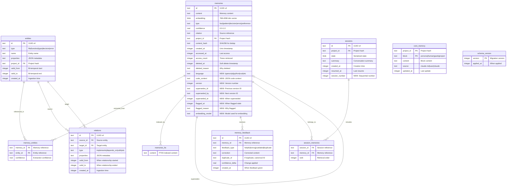

# Database Design Extension: claude-memory v2.0

## Document Information

| Field | Value |
|-------|-------|
| Version | 2.0 |
| Date | 2026-01-18 |
| Status | Draft |
| Extends | DATABASE.md v1.0 |
| Migration | V1 → V2 |

## Overview

This document describes schema changes to support:
1. Source code knowledge (language, code context)
2. Memory versioning and relationships
3. Feedback tracking
4. Staleness detection

All changes are **backward compatible** via migrations.

---

## 1. Schema Changes

### 1.1 Updated Entity-Relationship Diagram



---

## 2. New Columns Detail

### 2.1 memories Table Additions

| Column | Type | Default | Description |
|--------|------|---------|-------------|
| `language` | TEXT | NULL | Programming language (typescript, python, etc.) |
| `code_context` | TEXT | NULL | JSON: {filePath, startLine, endLine, symbolName, symbolType} |
| `version` | INTEGER | 1 | Version number for this memory |
| `supersedes_id` | TEXT | NULL | ID of memory this supersedes |
| `superseded_by` | TEXT | NULL | ID of memory that superseded this |
| `superseded_at` | INTEGER | NULL | Unix timestamp when superseded |
| `flagged_at` | INTEGER | NULL | Unix timestamp when flagged stale |
| `flagged_reason` | TEXT | NULL | Reason for staleness flag |
| `embedding_model` | TEXT | NULL | Model ID used for embedding |

### 2.2 New Table: memory_feedback

```sql
CREATE TABLE memory_feedback (
    id TEXT PRIMARY KEY,
    memory_id TEXT NOT NULL REFERENCES memories(id),
    feedback_type TEXT NOT NULL CHECK (
        feedback_type IN ('helpful', 'wrong', 'outdated', 'duplicate')
    ),
    correction TEXT,
    duplicate_of TEXT REFERENCES memories(id),
    confidence_delta REAL NOT NULL,
    created_at INTEGER NOT NULL
);

CREATE INDEX idx_feedback_memory ON memory_feedback(memory_id);
CREATE INDEX idx_feedback_type ON memory_feedback(feedback_type);
```

### 2.3 sessions Table Addition

| Column | Type | Default | Description |
|--------|------|---------|-------------|
| `session_number` | INTEGER | NULL | Sequential session count for staleness tracking |

---

## 3. Language Enum

```sql
-- Valid values for language column
-- Enforced at application level, not DB constraint
-- (to allow future additions without migration)

-- Supported languages:
-- typescript, javascript, python, rust, go, java,
-- c, cpp, ruby, php, shell, sql, markdown, json, yaml, other
```

---

## 4. Code Context JSON Schema

```json
{
  "type": "object",
  "properties": {
    "filePath": {
      "type": "string",
      "description": "Relative path from project root"
    },
    "startLine": {
      "type": "integer",
      "minimum": 1
    },
    "endLine": {
      "type": "integer",
      "minimum": 1
    },
    "symbolName": {
      "type": "string",
      "description": "Function, class, or variable name"
    },
    "symbolType": {
      "type": "string",
      "enum": ["function", "class", "variable", "type", "module", "method"]
    }
  },
  "required": ["filePath", "startLine"]
}
```

**Example:**
```json
{
  "filePath": "src/services/UserService.ts",
  "startLine": 45,
  "endLine": 120,
  "symbolName": "UserService",
  "symbolType": "class"
}
```

---

## 5. Migration Scripts

### 5.1 Migration V2: Add Source Code Knowledge

```sql
-- Migration: 2
-- Description: Add source code knowledge fields

-- Add language field
ALTER TABLE memories ADD COLUMN language TEXT;

-- Add code context (JSON)
ALTER TABLE memories ADD COLUMN code_context TEXT;

-- Create index for language filtering
CREATE INDEX idx_memories_language ON memories(project_id, language);
```

### 5.2 Migration V3: Add Memory Versioning

```sql
-- Migration: 3
-- Description: Add memory versioning and relationships

-- Version tracking
ALTER TABLE memories ADD COLUMN version INTEGER DEFAULT 1;
ALTER TABLE memories ADD COLUMN supersedes_id TEXT REFERENCES memories(id);
ALTER TABLE memories ADD COLUMN superseded_by TEXT;
ALTER TABLE memories ADD COLUMN superseded_at INTEGER;

-- Index for version queries
CREATE INDEX idx_memories_supersedes ON memories(supersedes_id);
CREATE INDEX idx_memories_version ON memories(project_id, version);
```

### 5.3 Migration V4: Add Feedback System

```sql
-- Migration: 4
-- Description: Add feedback tracking

-- Feedback table
CREATE TABLE IF NOT EXISTS memory_feedback (
    id TEXT PRIMARY KEY,
    memory_id TEXT NOT NULL REFERENCES memories(id),
    feedback_type TEXT NOT NULL CHECK (
        feedback_type IN ('helpful', 'wrong', 'outdated', 'duplicate')
    ),
    correction TEXT,
    duplicate_of TEXT REFERENCES memories(id),
    confidence_delta REAL NOT NULL,
    created_at INTEGER NOT NULL
);

CREATE INDEX IF NOT EXISTS idx_feedback_memory ON memory_feedback(memory_id);
CREATE INDEX IF NOT EXISTS idx_feedback_type ON memory_feedback(feedback_type);
```

### 5.4 Migration V5: Add Staleness Detection

```sql
-- Migration: 5
-- Description: Add staleness tracking

-- Staleness fields
ALTER TABLE memories ADD COLUMN flagged_at INTEGER;
ALTER TABLE memories ADD COLUMN flagged_reason TEXT;

-- Embedding model tracking (for re-embedding)
ALTER TABLE memories ADD COLUMN embedding_model TEXT;

-- Session numbering for access tracking
ALTER TABLE sessions ADD COLUMN session_number INTEGER;

-- Index for staleness queries
CREATE INDEX idx_memories_flagged ON memories(project_id, flagged_at);
```

### 5.5 Migration V6: Backfill Language from Citations

```sql
-- Migration: 6
-- Description: Backfill language field from existing citations

UPDATE memories
SET language = CASE
    WHEN citation LIKE '%.ts:%' OR citation LIKE '%.tsx:%' THEN 'typescript'
    WHEN citation LIKE '%.js:%' OR citation LIKE '%.jsx:%' OR citation LIKE '%.mjs:%' THEN 'javascript'
    WHEN citation LIKE '%.py:%' THEN 'python'
    WHEN citation LIKE '%.rs:%' THEN 'rust'
    WHEN citation LIKE '%.go:%' THEN 'go'
    WHEN citation LIKE '%.java:%' THEN 'java'
    WHEN citation LIKE '%.c:%' OR citation LIKE '%.h:%' THEN 'c'
    WHEN citation LIKE '%.cpp:%' OR citation LIKE '%.hpp:%' OR citation LIKE '%.cc:%' THEN 'cpp'
    WHEN citation LIKE '%.rb:%' THEN 'ruby'
    WHEN citation LIKE '%.php:%' THEN 'php'
    WHEN citation LIKE '%.sh:%' OR citation LIKE '%.bash:%' THEN 'shell'
    WHEN citation LIKE '%.sql:%' THEN 'sql'
    WHEN citation LIKE '%.md:%' THEN 'markdown'
    WHEN citation LIKE '%.json:%' THEN 'json'
    WHEN citation LIKE '%.yaml:%' OR citation LIKE '%.yml:%' THEN 'yaml'
    ELSE NULL
END
WHERE citation IS NOT NULL AND language IS NULL;
```

---

## 6. Query Patterns

### 6.1 Find Memories by Language

```sql
SELECT * FROM memories
WHERE project_id = ?
  AND language = 'typescript'
  AND deleted_at IS NULL
  AND superseded_by IS NULL
  AND flagged_at IS NULL
ORDER BY accessed_at DESC
LIMIT 10;
```

### 6.2 Get Memory Version History

```sql
-- Get all versions of a memory (most recent first)
WITH RECURSIVE version_chain AS (
    -- Start with the latest version
    SELECT m.*, 0 as depth
    FROM memories m
    WHERE m.id = ? AND m.superseded_by IS NULL

    UNION ALL

    -- Walk back through supersedes chain
    SELECT m.*, vc.depth + 1
    FROM memories m
    JOIN version_chain vc ON m.id = vc.supersedes_id
)
SELECT * FROM version_chain
ORDER BY depth ASC;
```

### 6.3 Find Stale Memories

```sql
-- Memories not accessed in recent sessions
SELECT m.*
FROM memories m
JOIN sessions s ON m.project_id = s.project_id
WHERE m.project_id = ?
  AND m.deleted_at IS NULL
  AND m.flagged_at IS NULL
  AND s.session_number = (
      SELECT MAX(session_number) FROM sessions WHERE project_id = ?
  )
  AND m.accessed_at < (
      SELECT created_at FROM sessions
      WHERE project_id = ?
      ORDER BY session_number DESC
      LIMIT 1 OFFSET 10  -- 10 sessions ago
  );
```

### 6.4 Get Feedback Statistics

```sql
SELECT
    m.id,
    m.content,
    m.confidence,
    COUNT(CASE WHEN f.feedback_type = 'helpful' THEN 1 END) as helpful_count,
    COUNT(CASE WHEN f.feedback_type = 'wrong' THEN 1 END) as wrong_count,
    COUNT(CASE WHEN f.feedback_type = 'outdated' THEN 1 END) as outdated_count,
    SUM(f.confidence_delta) as total_confidence_change
FROM memories m
LEFT JOIN memory_feedback f ON m.id = f.memory_id
WHERE m.project_id = ?
GROUP BY m.id
HAVING wrong_count > 0 OR outdated_count > 0
ORDER BY wrong_count DESC;
```

---

## 7. Index Strategy

### 7.1 New Indexes

| Index | Columns | Purpose |
|-------|---------|---------|
| `idx_memories_language` | (project_id, language) | Language filtering |
| `idx_memories_supersedes` | (supersedes_id) | Version chain traversal |
| `idx_memories_version` | (project_id, version) | Version queries |
| `idx_memories_flagged` | (project_id, flagged_at) | Staleness queries |
| `idx_feedback_memory` | (memory_id) | Feedback lookup |
| `idx_feedback_type` | (feedback_type) | Feedback statistics |

### 7.2 Composite Index for Common Query

```sql
-- Optimizes: active memories by language
CREATE INDEX idx_memories_active_lang ON memories(
    project_id,
    language,
    deleted_at,
    superseded_by,
    flagged_at
);
```

---

## 8. Data Integrity

### 8.1 Constraints

```sql
-- Ensure version consistency
CREATE TRIGGER check_version_consistency
BEFORE INSERT ON memories
BEGIN
    SELECT CASE
        WHEN NEW.supersedes_id IS NOT NULL AND NEW.version <= (
            SELECT version FROM memories WHERE id = NEW.supersedes_id
        )
        THEN RAISE(ABORT, 'New version must be greater than superseded version')
    END;
END;

-- Ensure supersedes chain is within project
CREATE TRIGGER check_supersedes_project
BEFORE INSERT ON memories
BEGIN
    SELECT CASE
        WHEN NEW.supersedes_id IS NOT NULL AND NEW.project_id != (
            SELECT project_id FROM memories WHERE id = NEW.supersedes_id
        )
        THEN RAISE(ABORT, 'Cannot supersede memory from different project')
    END;
END;
```

### 8.2 Feedback Confidence Bounds

```sql
-- Ensure confidence stays in bounds after feedback
CREATE TRIGGER bound_confidence_after_feedback
AFTER INSERT ON memory_feedback
BEGIN
    UPDATE memories
    SET confidence = MAX(0.1, MIN(1.0, confidence + NEW.confidence_delta))
    WHERE id = NEW.memory_id;
END;
```

---

## 9. Migration Rollback

### 9.1 Rollback V6 (Backfill)

```sql
-- Simply sets language back to NULL (safe)
UPDATE memories SET language = NULL WHERE language IS NOT NULL;
```

### 9.2 Rollback V5 (Staleness)

```sql
ALTER TABLE sessions DROP COLUMN session_number;
ALTER TABLE memories DROP COLUMN embedding_model;
ALTER TABLE memories DROP COLUMN flagged_reason;
ALTER TABLE memories DROP COLUMN flagged_at;
DROP INDEX IF EXISTS idx_memories_flagged;
```

### 9.3 Rollback V4 (Feedback)

```sql
DROP INDEX IF EXISTS idx_feedback_type;
DROP INDEX IF EXISTS idx_feedback_memory;
DROP TABLE IF EXISTS memory_feedback;
```

### 9.4 Rollback V3 (Versioning)

```sql
DROP INDEX IF EXISTS idx_memories_version;
DROP INDEX IF EXISTS idx_memories_supersedes;
ALTER TABLE memories DROP COLUMN superseded_at;
ALTER TABLE memories DROP COLUMN superseded_by;
ALTER TABLE memories DROP COLUMN supersedes_id;
ALTER TABLE memories DROP COLUMN version;
```

### 9.5 Rollback V2 (Language)

```sql
DROP INDEX IF EXISTS idx_memories_language;
ALTER TABLE memories DROP COLUMN code_context;
ALTER TABLE memories DROP COLUMN language;
```

---

## 10. Performance Considerations

### 10.1 Expected Table Sizes

| Table | Rows (typical) | Growth Rate |
|-------|----------------|-------------|
| memories | 100-10,000 | ~10-50/session |
| memory_feedback | 0-1,000 | ~1-5/session |
| sessions | 10-500 | 1/session |

### 10.2 Query Performance Targets

| Query | Target | Notes |
|-------|--------|-------|
| Language filter | <10ms | With index |
| Version chain | <20ms | Recursive CTE |
| Staleness scan | <100ms | On session start only |
| Feedback stats | <50ms | Aggregate query |

---

## 11. Acceptance Criteria

- [ ] All migrations apply cleanly
- [ ] Rollbacks restore previous state
- [ ] Language filtering <10ms for 1000 memories
- [ ] Version chain traversal works correctly
- [ ] Feedback triggers update confidence
- [ ] Existing data preserved after migration
- [ ] Backfill correctly identifies languages
