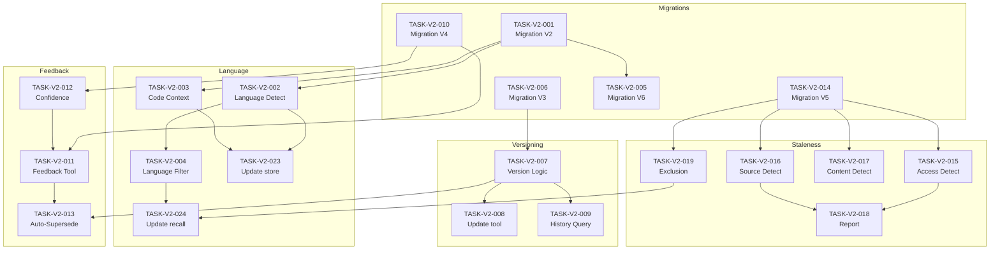

# Implementation Tasks Extension: claude-memory v2.0

## Document Information

| Field | Value |
|-------|-------|
| Version | 2.0 |
| Date | 2026-01-18 |
| Status | Draft |
| Extends | TASKS.md v1.1 |
| Total New Tasks | 24 |

## Progress Summary

| Status | Count | Percentage |
|--------|-------|------------|
| Done | 0 | 0% |
| Partial | 0 | 0% |
| Pending | 24 | 100% |

### By Priority
| Priority | Total | Done | Pending |
|----------|-------|------|---------|
| P0 | 12 | 0 | 12 |
| P1 | 8 | 0 | 8 |
| P2 | 4 | 0 | 4 |

---

## Task Overview

| Task ID | Title | Module | Priority | Status | Requirements |
|---------|-------|--------|----------|--------|--------------|
| TASK-V2-001 | Schema Migration V2 (Language) | storage | P0 | Pending | FR-V2-001 |
| TASK-V2-002 | Language Detection Module | embeddings | P0 | Pending | FR-V2-001 |
| TASK-V2-003 | Code Context Parser | storage | P1 | Pending | FR-V2-002 |
| TASK-V2-004 | Language Filter in Search | search | P0 | Pending | FR-V2-003 |
| TASK-V2-005 | Language Backfill Migration | storage | P1 | Pending | FR-V2-004 |
| TASK-V2-006 | Schema Migration V3 (Versioning) | storage | P0 | Pending | FR-V2-005 |
| TASK-V2-007 | Memory Versioning Logic | storage | P0 | Pending | FR-V2-005, FR-V2-006 |
| TASK-V2-008 | Update memory_update Tool | tools | P0 | Pending | FR-V2-006 |
| TASK-V2-009 | Version History Query | storage | P1 | Pending | FR-V2-007 |
| TASK-V2-010 | Schema Migration V4 (Feedback) | storage | P0 | Pending | FR-V2-010 |
| TASK-V2-011 | memory_feedback Tool | tools | P0 | Pending | FR-V2-008 |
| TASK-V2-012 | Confidence Adjustment Logic | storage | P0 | Pending | FR-V2-009 |
| TASK-V2-013 | Correction Auto-Supersede | tools | P1 | Pending | FR-V2-011 |
| TASK-V2-014 | Schema Migration V5 (Staleness) | storage | P0 | Pending | FR-V2-015 |
| TASK-V2-015 | Access Staleness Detector | session | P0 | Pending | FR-V2-012 |
| TASK-V2-016 | Source Staleness Detector | session | P1 | Pending | FR-V2-013 |
| TASK-V2-017 | Content Staleness Detector | session | P2 | Pending | FR-V2-014 |
| TASK-V2-018 | Staleness Report Generator | session | P1 | Pending | FR-V2-016 |
| TASK-V2-019 | Stale Memory Exclusion | search | P0 | Pending | FR-V2-017 |
| TASK-V2-020 | Update SKILL.md for V2 | skill | P1 | Pending | - |
| TASK-V2-021 | V2 Unit Tests | tests | P2 | Pending | - |
| TASK-V2-022 | V2 Integration Tests | tests | P2 | Pending | - |
| TASK-V2-023 | Update memory_store Tool | tools | P0 | Pending | FR-V2-001, FR-V2-002 |
| TASK-V2-024 | Update memory_recall Tool | tools | P0 | Pending | FR-V2-003, FR-V2-017 |

---

## 1. Source Code Knowledge Tasks

### TASK-V2-001: Schema Migration V2 (Language)
**Priority:** P0 | **Module:** storage | **Effort:** Small

Add language field to memories table.

**Requirements:** FR-V2-001

**Implementation:**
```sql
-- migrations/002_language.sql
ALTER TABLE memories ADD COLUMN language TEXT;
ALTER TABLE memories ADD COLUMN code_context TEXT;
CREATE INDEX idx_memories_language ON memories(project_id, language);
```

**Files to Modify:**
- `mcp/memory-server/src/storage/schema.ts` - Add migration
- `mcp/memory-server/src/storage/migrations/` - Create 002_language.sql

**Acceptance Criteria:**
- [ ] Migration applies cleanly
- [ ] Rollback works
- [ ] language column accepts valid values
- [ ] Index created

---

### TASK-V2-002: Language Detection Module
**Priority:** P0 | **Module:** embeddings | **Effort:** Small

Create module to detect programming language from file extensions.

**Requirements:** FR-V2-001

**Implementation:**
```typescript
// mcp/memory-server/src/language/detector.ts
export function detectLanguage(citation: string | null): string | null {
  if (!citation) return null;

  const ext = citation.match(/\.([a-z]+):/i)?.[1]?.toLowerCase();

  const EXTENSION_MAP: Record<string, string> = {
    'ts': 'typescript', 'tsx': 'typescript',
    'js': 'javascript', 'jsx': 'javascript', 'mjs': 'javascript',
    'py': 'python',
    'rs': 'rust',
    'go': 'go',
    // ... etc
  };

  return EXTENSION_MAP[ext] || null;
}
```

**Files to Create:**
- `mcp/memory-server/src/language/detector.ts`
- `mcp/memory-server/src/language/index.ts`

**Acceptance Criteria:**
- [ ] Detects 15+ languages from extensions
- [ ] Returns null for unknown extensions
- [ ] Handles malformed citations gracefully

---

### TASK-V2-003: Code Context Parser
**Priority:** P1 | **Module:** storage | **Effort:** Medium

Parse structured code context from citation strings.

**Requirements:** FR-V2-002

**Implementation:**
```typescript
// mcp/memory-server/src/language/context.ts
export interface CodeContext {
  filePath: string;
  startLine: number;
  endLine?: number;
  symbolName?: string;
  symbolType?: 'function' | 'class' | 'variable' | 'type' | 'module' | 'method';
}

export function parseCodeContext(citation: string): CodeContext | null {
  // Parse "src/file.ts:45" or "src/file.ts:45-120"
  const match = citation.match(/^(.+):(\d+)(?:-(\d+))?$/);
  if (!match) return null;

  return {
    filePath: match[1],
    startLine: parseInt(match[2], 10),
    endLine: match[3] ? parseInt(match[3], 10) : undefined,
  };
}
```

**Files to Create:**
- `mcp/memory-server/src/language/context.ts`

**Acceptance Criteria:**
- [ ] Parses single line: "file.ts:45"
- [ ] Parses line range: "file.ts:45-120"
- [ ] Returns null for invalid format
- [ ] Stores as JSON in code_context column

---

### TASK-V2-004: Language Filter in Search
**Priority:** P0 | **Module:** search | **Effort:** Small

Add language filtering to hybrid search.

**Requirements:** FR-V2-003

**Implementation:**
```typescript
// Update HybridSearch.search()
interface SearchOptions {
  query: string;
  projectId: string;
  limit?: number;
  type?: MemoryType;
  minConfidence?: number;
  language?: string;  // NEW
}

// Filter after RRF fusion
if (options.language) {
  results = results.filter(r => r.memory.language === options.language);
}
```

**Files to Modify:**
- `mcp/memory-server/src/search/hybrid.ts`
- `mcp/memory-server/src/types.ts`

**Acceptance Criteria:**
- [ ] language parameter accepted
- [ ] Only matching memories returned
- [ ] NULL language not filtered out when no filter
- [ ] Performance <10ms overhead

---

### TASK-V2-005: Language Backfill Migration
**Priority:** P1 | **Module:** storage | **Effort:** Small

Migrate existing memories to populate language from citations.

**Requirements:** FR-V2-004

**Implementation:**
```sql
-- migrations/006_backfill_language.sql
UPDATE memories
SET language = CASE
    WHEN citation LIKE '%.ts:%' OR citation LIKE '%.tsx:%' THEN 'typescript'
    WHEN citation LIKE '%.js:%' OR citation LIKE '%.jsx:%' THEN 'javascript'
    WHEN citation LIKE '%.py:%' THEN 'python'
    WHEN citation LIKE '%.rs:%' THEN 'rust'
    WHEN citation LIKE '%.go:%' THEN 'go'
    -- ... full mapping
    ELSE NULL
END
WHERE citation IS NOT NULL AND language IS NULL;
```

**Files to Modify:**
- `mcp/memory-server/src/storage/migrations/` - Create 006_backfill_language.sql

**Acceptance Criteria:**
- [ ] Existing citations parsed correctly
- [ ] NULL preserved for non-code citations
- [ ] Idempotent (can run multiple times)

---

## 2. Memory Versioning Tasks

### TASK-V2-006: Schema Migration V3 (Versioning)
**Priority:** P0 | **Module:** storage | **Effort:** Small

Add versioning columns to memories table.

**Requirements:** FR-V2-005

**Implementation:**
```sql
-- migrations/003_versioning.sql
ALTER TABLE memories ADD COLUMN version INTEGER DEFAULT 1;
ALTER TABLE memories ADD COLUMN supersedes_id TEXT REFERENCES memories(id);
ALTER TABLE memories ADD COLUMN superseded_by TEXT;
ALTER TABLE memories ADD COLUMN superseded_at INTEGER;

CREATE INDEX idx_memories_supersedes ON memories(supersedes_id);
CREATE INDEX idx_memories_version ON memories(project_id, version);
```

**Files to Modify:**
- `mcp/memory-server/src/storage/schema.ts`
- `mcp/memory-server/src/storage/migrations/` - Create 003_versioning.sql

**Acceptance Criteria:**
- [ ] Columns added with defaults
- [ ] Indexes created
- [ ] Rollback works

---

### TASK-V2-007: Memory Versioning Logic
**Priority:** P0 | **Module:** storage | **Effort:** Medium

Implement version chain logic in repository.

**Requirements:** FR-V2-005, FR-V2-006

**Implementation:**
```typescript
// mcp/memory-server/src/storage/repository.ts
createSupersedingMemory(
  oldId: string,
  newContent: string,
  projectId: string
): Memory {
  const old = this.findById(oldId, projectId);
  if (!old) throw new Error('Memory not found');

  const newMemory = this.createMemory({
    ...old,
    content: newContent,
    version: old.version + 1,
    supersedes_id: old.id,
  });

  // Mark old as superseded
  this.db.prepare(`
    UPDATE memories
    SET superseded_by = ?, superseded_at = ?
    WHERE id = ?
  `).run(newMemory.id, Date.now(), old.id);

  return newMemory;
}
```

**Files to Modify:**
- `mcp/memory-server/src/storage/repository.ts`
- `mcp/memory-server/src/types.ts` - Add version fields

**Acceptance Criteria:**
- [ ] New version has incremented version number
- [ ] supersedes_id links to old memory
- [ ] Old memory has superseded_by and superseded_at set
- [ ] Version chain traversable

---

### TASK-V2-008: Update memory_update Tool
**Priority:** P0 | **Module:** tools | **Effort:** Small

Change memory_update to use versioning instead of in-place update.

**Requirements:** FR-V2-006

**Implementation:**
```typescript
// mcp/memory-server/src/tools/memory_update.ts
// Change from in-place update to supersession
const newMemory = repo.createSupersedingMemory(id, content, projectId);
return {
  content: [{
    type: 'text',
    text: `Memory updated (v${newMemory.version}). Old version preserved.`
  }]
};
```

**Files to Modify:**
- `mcp/memory-server/src/tools/memory_update.ts`

**Acceptance Criteria:**
- [ ] Update creates new memory
- [ ] Old memory preserved
- [ ] Returns new memory ID and version

---

### TASK-V2-009: Version History Query
**Priority:** P1 | **Module:** storage | **Effort:** Medium

Implement version chain traversal query.

**Requirements:** FR-V2-007

**Implementation:**
```typescript
// mcp/memory-server/src/storage/repository.ts
getVersionHistory(id: string, projectId: string): Memory[] {
  return this.db.prepare(`
    WITH RECURSIVE version_chain AS (
      SELECT m.*, 0 as depth FROM memories m
      WHERE m.id = ? AND m.project_id = ? AND m.superseded_by IS NULL
      UNION ALL
      SELECT m.*, vc.depth + 1
      FROM memories m
      JOIN version_chain vc ON m.id = vc.supersedes_id
    )
    SELECT * FROM version_chain ORDER BY depth ASC
  `).all(id, projectId);
}
```

**Files to Modify:**
- `mcp/memory-server/src/storage/repository.ts`

**Acceptance Criteria:**
- [ ] Returns full version chain
- [ ] Most recent first
- [ ] Handles orphaned chains gracefully
- [ ] Performance <20ms for 10 versions

---

## 3. Feedback Loop Tasks

### TASK-V2-010: Schema Migration V4 (Feedback)
**Priority:** P0 | **Module:** storage | **Effort:** Small

Create memory_feedback table.

**Requirements:** FR-V2-010

**Implementation:**
```sql
-- migrations/004_feedback.sql
CREATE TABLE IF NOT EXISTS memory_feedback (
    id TEXT PRIMARY KEY,
    memory_id TEXT NOT NULL REFERENCES memories(id),
    feedback_type TEXT NOT NULL CHECK (
        feedback_type IN ('helpful', 'wrong', 'outdated', 'duplicate')
    ),
    correction TEXT,
    duplicate_of TEXT REFERENCES memories(id),
    confidence_delta REAL NOT NULL,
    created_at INTEGER NOT NULL
);

CREATE INDEX idx_feedback_memory ON memory_feedback(memory_id);
CREATE INDEX idx_feedback_type ON memory_feedback(feedback_type);
```

**Files to Modify:**
- `mcp/memory-server/src/storage/schema.ts`
- `mcp/memory-server/src/storage/migrations/` - Create 004_feedback.sql

**Acceptance Criteria:**
- [ ] Table created with constraints
- [ ] Indexes created
- [ ] Rollback drops table

---

### TASK-V2-011: memory_feedback Tool
**Priority:** P0 | **Module:** tools | **Effort:** Medium

Implement the memory_feedback MCP tool.

**Requirements:** FR-V2-008

**Implementation:**
```typescript
// mcp/memory-server/src/tools/memory_feedback.ts
{
  name: 'memory_feedback',
  description: 'Provide feedback on a recalled memory',
  inputSchema: {
    type: 'object',
    properties: {
      id: { type: 'string', format: 'uuid' },
      feedback: {
        type: 'string',
        enum: ['helpful', 'wrong', 'outdated', 'duplicate']
      },
      correction: { type: 'string' },
      duplicateOf: { type: 'string' }
    },
    required: ['id', 'feedback']
  },
  handler: async (args) => {
    const delta = CONFIDENCE_DELTAS[args.feedback];
    repo.recordFeedback(args.id, args.feedback, delta, args.correction);

    if (args.feedback === 'wrong' && args.correction) {
      // Auto-create superseding memory
      repo.createSupersedingMemory(args.id, args.correction, projectId);
    }

    return { content: [{ type: 'text', text: 'Feedback recorded.' }] };
  }
}
```

**Files to Create:**
- `mcp/memory-server/src/tools/memory_feedback.ts`

**Files to Modify:**
- `mcp/memory-server/src/index.ts` - Register tool

**Acceptance Criteria:**
- [ ] Tool registered in MCP server
- [ ] All 4 feedback types accepted
- [ ] Confidence adjusted correctly
- [ ] Feedback stored in database

---

### TASK-V2-012: Confidence Adjustment Logic
**Priority:** P0 | **Module:** storage | **Effort:** Small

Implement confidence adjustment with bounds.

**Requirements:** FR-V2-009

**Implementation:**
```typescript
// mcp/memory-server/src/storage/repository.ts
const CONFIDENCE_DELTAS = {
  helpful: 0.05,
  wrong: -0.20,
  outdated: -0.30,
  duplicate: 0,
};

recordFeedback(
  memoryId: string,
  feedbackType: FeedbackType,
  correction?: string
): void {
  const delta = CONFIDENCE_DELTAS[feedbackType];

  // Insert feedback record
  this.db.prepare(`
    INSERT INTO memory_feedback (id, memory_id, feedback_type, correction, confidence_delta, created_at)
    VALUES (?, ?, ?, ?, ?, ?)
  `).run(uuid(), memoryId, feedbackType, correction, delta, Date.now());

  // Adjust confidence with bounds
  this.db.prepare(`
    UPDATE memories
    SET confidence = MAX(0.1, MIN(1.0, confidence + ?))
    WHERE id = ?
  `).run(delta, memoryId);
}
```

**Files to Modify:**
- `mcp/memory-server/src/storage/repository.ts`

**Acceptance Criteria:**
- [ ] Deltas match specification
- [ ] Confidence bounded [0.1, 1.0]
- [ ] Feedback persisted

---

### TASK-V2-013: Correction Auto-Supersede
**Priority:** P1 | **Module:** tools | **Effort:** Small

Auto-create superseding memory from corrections.

**Requirements:** FR-V2-011

**Implementation:**
Integrated into TASK-V2-011 handler.

**Acceptance Criteria:**
- [ ] Wrong + correction creates new memory
- [ ] Old memory superseded
- [ ] New memory has corrected content

---

## 4. Staleness Detection Tasks

### TASK-V2-014: Schema Migration V5 (Staleness)
**Priority:** P0 | **Module:** storage | **Effort:** Small

Add staleness tracking columns.

**Requirements:** FR-V2-015

**Implementation:**
```sql
-- migrations/005_staleness.sql
ALTER TABLE memories ADD COLUMN flagged_at INTEGER;
ALTER TABLE memories ADD COLUMN flagged_reason TEXT;
ALTER TABLE memories ADD COLUMN embedding_model TEXT;
ALTER TABLE sessions ADD COLUMN session_number INTEGER;

CREATE INDEX idx_memories_flagged ON memories(project_id, flagged_at);
```

**Files to Modify:**
- `mcp/memory-server/src/storage/schema.ts`
- `mcp/memory-server/src/storage/migrations/` - Create 005_staleness.sql

**Acceptance Criteria:**
- [ ] Columns added
- [ ] Index created
- [ ] Rollback works

---

### TASK-V2-015: Access Staleness Detector
**Priority:** P0 | **Module:** session | **Effort:** Medium

Detect memories not accessed in recent sessions.

**Requirements:** FR-V2-012

**Implementation:**
```typescript
// mcp/memory-server/src/staleness/detector.ts
detectAccessStale(projectId: string, sessionThreshold: number = 10): Memory[] {
  const currentSession = this.getCurrentSessionNumber(projectId);
  const threshold = currentSession - sessionThreshold;

  return this.db.prepare(`
    SELECT m.* FROM memories m
    WHERE m.project_id = ?
      AND m.deleted_at IS NULL
      AND m.flagged_at IS NULL
      AND m.accessed_at < (
        SELECT created_at FROM sessions
        WHERE project_id = ?
        ORDER BY session_number DESC
        LIMIT 1 OFFSET ?
      )
  `).all(projectId, projectId, sessionThreshold);
}
```

**Files to Create:**
- `mcp/memory-server/src/staleness/detector.ts`
- `mcp/memory-server/src/staleness/index.ts`

**Acceptance Criteria:**
- [ ] Identifies memories not accessed in N sessions
- [ ] Respects deleted/flagged exclusions
- [ ] Performance <100ms/1000 memories

---

### TASK-V2-016: Source Staleness Detector
**Priority:** P1 | **Module:** session | **Effort:** Medium

Detect memories whose citation files no longer exist.

**Requirements:** FR-V2-013

**Implementation:**
```typescript
// mcp/memory-server/src/staleness/detector.ts
import { existsSync } from 'fs';
import { resolve } from 'path';

detectSourceMissing(projectId: string, projectRoot: string): Memory[] {
  const memories = this.getMemoriesWithCitations(projectId);

  return memories.filter(m => {
    const context = parseCodeContext(m.citation);
    if (!context) return false;

    const fullPath = resolve(projectRoot, context.filePath);
    return !existsSync(fullPath);
  });
}
```

**Files to Modify:**
- `mcp/memory-server/src/staleness/detector.ts`

**Acceptance Criteria:**
- [ ] Checks file existence
- [ ] Only checks memories with citations
- [ ] Returns flaggable memories

---

### TASK-V2-017: Content Staleness Detector
**Priority:** P2 | **Module:** session | **Effort:** Large

Detect memories whose citation file content changed.

**Requirements:** FR-V2-014

**Implementation:**
- Store content hash in code_context JSON
- Compare on session restore
- Flag if hash differs

**Acceptance Criteria:**
- [ ] Hash stored on memory creation
- [ ] Hash compared on check
- [ ] Significant changes flagged

---

### TASK-V2-018: Staleness Report Generator
**Priority:** P1 | **Module:** session | **Effort:** Medium

Generate formatted staleness report on session restore.

**Requirements:** FR-V2-016

**Implementation:**
```typescript
// mcp/memory-server/src/staleness/report.ts
generateReport(projectId: string): string {
  const accessStale = this.detectAccessStale(projectId);
  const sourceMissing = this.detectSourceMissing(projectId, projectRoot);

  if (accessStale.length === 0 && sourceMissing.length === 0) {
    return null; // No report needed
  }

  return `
Memory Staleness Report
═══════════════════════════════════════
${sourceMissing.length > 0 ? `
Source Missing (${sourceMissing.length}):
${sourceMissing.map(m => `  - "${m.content.slice(0, 40)}..." - file deleted`).join('\n')}
` : ''}
${accessStale.length > 0 ? `
Not Accessed (${accessStale.length}):
${accessStale.map(m => `  - "${m.content.slice(0, 40)}..."`).join('\n')}
` : ''}
Run: memory_recall({ query: "stale:true" }) to review
  `.trim();
}
```

**Files to Create:**
- `mcp/memory-server/src/staleness/report.ts`

**Acceptance Criteria:**
- [ ] Report formatted correctly
- [ ] Categories separated
- [ ] Returns null if no stale memories

---

### TASK-V2-019: Stale Memory Exclusion
**Priority:** P0 | **Module:** search | **Effort:** Small

Exclude flagged memories from default search.

**Requirements:** FR-V2-017

**Implementation:**
```typescript
// Update findByProject and search queries
interface SearchOptions {
  // ... existing
  includeStale?: boolean;  // NEW
}

// In query builder
if (!options.includeStale) {
  conditions.push('flagged_at IS NULL');
}
```

**Files to Modify:**
- `mcp/memory-server/src/storage/repository.ts`
- `mcp/memory-server/src/search/hybrid.ts`

**Acceptance Criteria:**
- [ ] Stale excluded by default
- [ ] includeStale=true returns all
- [ ] Backward compatible

---

## 5. Tool Updates

### TASK-V2-023: Update memory_store Tool
**Priority:** P0 | **Module:** tools | **Effort:** Small

Add language and codeContext parameters to memory_store.

**Requirements:** FR-V2-001, FR-V2-002

**Implementation:**
```typescript
// Update input schema
inputSchema: {
  properties: {
    // ... existing
    language: { type: 'string' },  // NEW
    codeContext: {                  // NEW
      type: 'object',
      properties: {
        filePath: { type: 'string' },
        startLine: { type: 'integer' },
        endLine: { type: 'integer' },
        symbolName: { type: 'string' },
        symbolType: { type: 'string' }
      }
    }
  }
}

// In handler
const language = args.language || detectLanguage(args.citation);
const codeContext = args.codeContext || parseCodeContext(args.citation);
```

**Files to Modify:**
- `mcp/memory-server/src/tools/memory_store.ts`

**Acceptance Criteria:**
- [ ] language parameter accepted
- [ ] codeContext parameter accepted
- [ ] Auto-detection from citation works

---

### TASK-V2-024: Update memory_recall Tool
**Priority:** P0 | **Module:** tools | **Effort:** Small

Add language, includeStale, includeSuperseded parameters.

**Requirements:** FR-V2-003, FR-V2-017

**Implementation:**
```typescript
// Update input schema
inputSchema: {
  properties: {
    // ... existing
    language: { type: 'string' },           // NEW
    includeStale: { type: 'boolean' },      // NEW
    includeSuperseded: { type: 'boolean' }  // NEW
  }
}
```

**Files to Modify:**
- `mcp/memory-server/src/tools/memory_recall.ts`

**Acceptance Criteria:**
- [ ] language filter works
- [ ] includeStale works
- [ ] includeSuperseded works

---

## 6. Supporting Tasks

### TASK-V2-020: Update SKILL.md for V2
**Priority:** P1 | **Module:** skill | **Effort:** Medium

Update skill documentation for new features.

**Additions:**
- Language-aware storage guidance
- Feedback best practices
- Staleness awareness

**Files to Modify:**
- `skills/memory/SKILL.md`

**Acceptance Criteria:**
- [ ] Language feature documented
- [ ] Feedback flow documented
- [ ] Token count still <2000

---

### TASK-V2-021: V2 Unit Tests
**Priority:** P2 | **Module:** tests | **Effort:** Large

Add unit tests for V2 features.

**Coverage:**
- Language detection (15 extensions)
- Code context parsing
- Version chain traversal
- Confidence adjustment
- Staleness detection

**Files to Create:**
- `tests/unit/language.test.ts`
- `tests/unit/versioning.test.ts`
- `tests/unit/feedback.test.ts`
- `tests/unit/staleness.test.ts`

**Acceptance Criteria:**
- [ ] >80% coverage on new code
- [ ] All edge cases tested

---

### TASK-V2-022: V2 Integration Tests
**Priority:** P2 | **Module:** tests | **Effort:** Large

Add integration tests for V2 flows.

**Coverage:**
- memory_store with language
- memory_recall with language filter
- memory_feedback flow
- memory_update versioning
- session_restore staleness report

**Files to Modify:**
- `tests/integration/mcp-tools.test.ts`

**Acceptance Criteria:**
- [ ] All V2 tools tested
- [ ] End-to-end flows verified

---

## Dependency Graph



---

## Implementation Order

### Sprint 1: Foundations (P0 Migrations + Core Logic)
1. TASK-V2-001: Schema Migration V2 (Language)
2. TASK-V2-006: Schema Migration V3 (Versioning)
3. TASK-V2-010: Schema Migration V4 (Feedback)
4. TASK-V2-014: Schema Migration V5 (Staleness)
5. TASK-V2-002: Language Detection Module
6. TASK-V2-007: Memory Versioning Logic
7. TASK-V2-012: Confidence Adjustment Logic

### Sprint 2: Tools + Search (P0 Tools)
8. TASK-V2-023: Update memory_store Tool
9. TASK-V2-004: Language Filter in Search
10. TASK-V2-024: Update memory_recall Tool
11. TASK-V2-008: Update memory_update Tool
12. TASK-V2-011: memory_feedback Tool
13. TASK-V2-019: Stale Memory Exclusion
14. TASK-V2-015: Access Staleness Detector

### Sprint 3: P1 Features
15. TASK-V2-003: Code Context Parser
16. TASK-V2-005: Language Backfill Migration
17. TASK-V2-009: Version History Query
18. TASK-V2-013: Correction Auto-Supersede
19. TASK-V2-016: Source Staleness Detector
20. TASK-V2-018: Staleness Report Generator
21. TASK-V2-020: Update SKILL.md

### Sprint 4: P2 + Polish
22. TASK-V2-017: Content Staleness Detector
23. TASK-V2-021: V2 Unit Tests
24. TASK-V2-022: V2 Integration Tests
